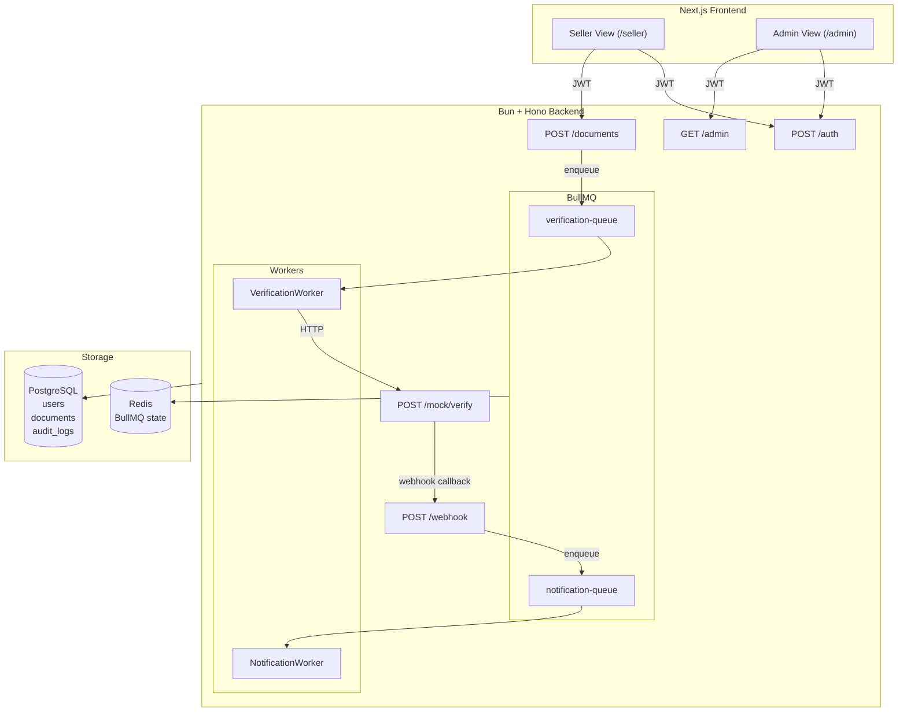
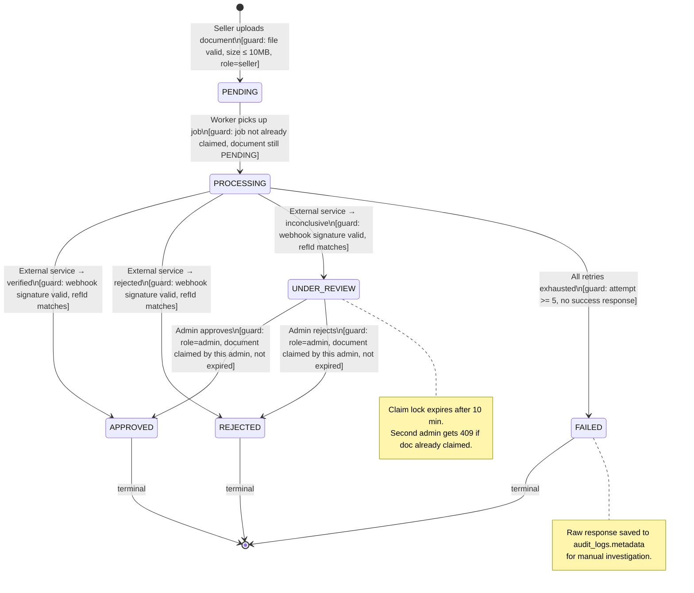
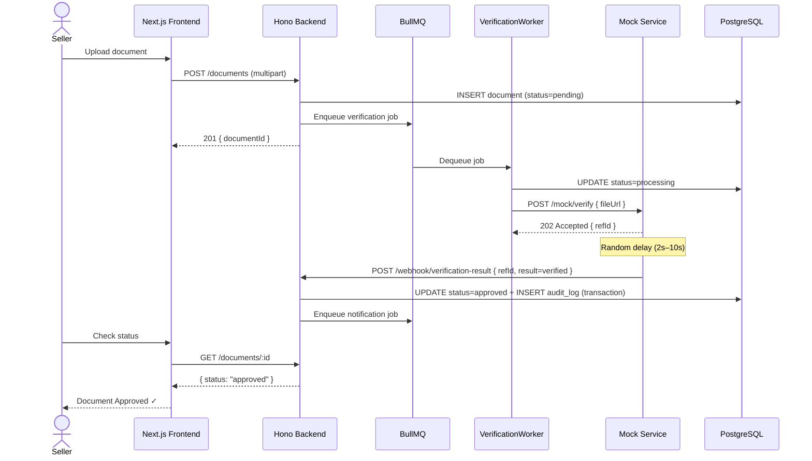
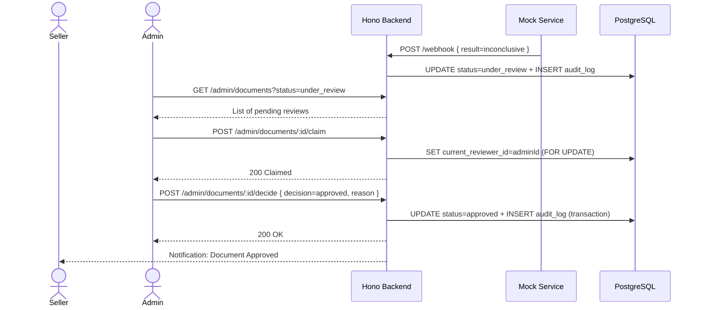
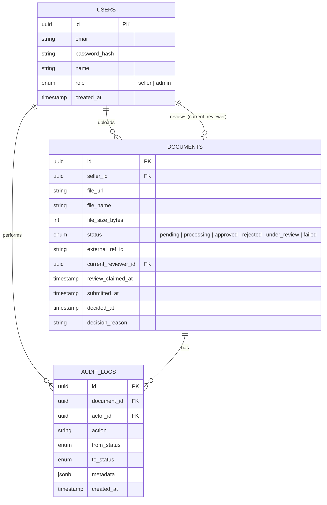

# Diagrams — Document Verification Workflow

## 1. System Architecture

---

## 2. State Machine — Document Verification

---

## 3. Sequence — Happy Path (Auto Verified)

---

## 4. Sequence — Inconclusive → Admin Review

---

## 5. Data Model (ER Diagram)

